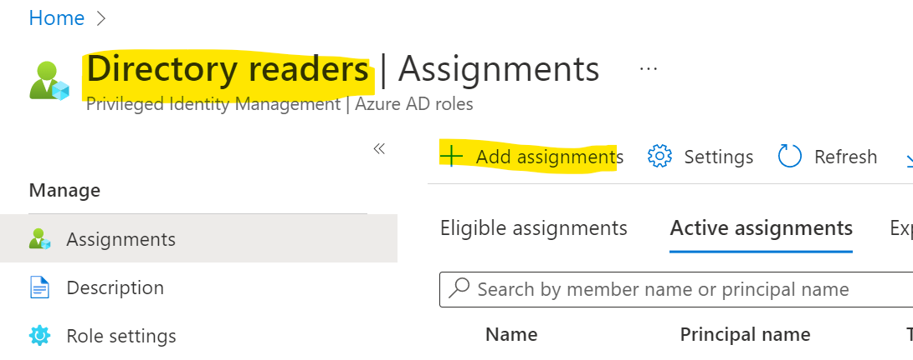
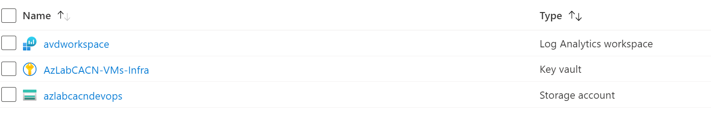
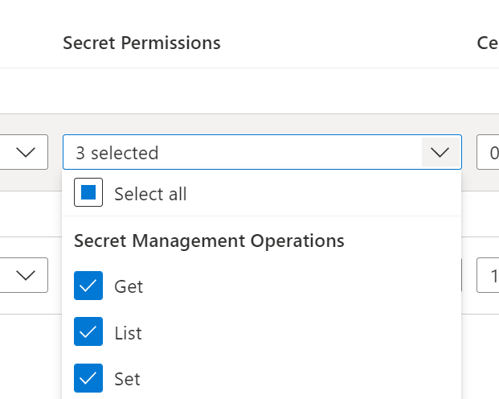
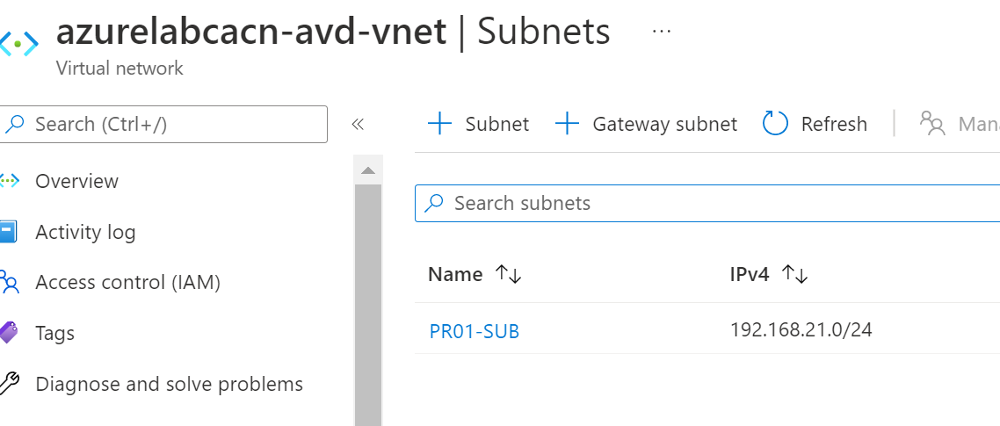
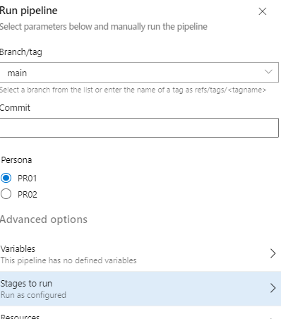
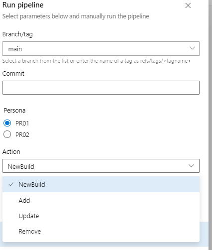
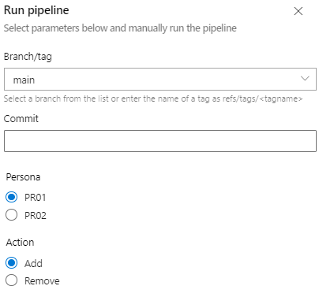

# Deployment Guide 

Prior the solution deployment please ensure Azure DevOps is setup. For more information and guidance please see [Azure DevOps Setup Guide](azure-devops-setup.md)

## Steps

* [Step 1: Create Service Principal Account & Assign RBAC](#step-1--create-service-principal-account--assign-rbac)
* [Step 2: Configure Service Connection in Azure DevOps Project Configuration](#step-2--configure-service-connection-in-azure-devops-project-configuration)
* [Step 3: Assign Service Principal Account Directory Reader Role](#step-3--assign-service-principal-account-directory-reader-role)
* [Step 4: Deploy Shared Infrastructure](#step-4--deploy-shared-infrastructure)
* [Step 5: Update or Add Persona configuration file](#step-5--update-or-add-persona-configuration-file)
* [Step 6: Deploy Persona and Pods](#step-6--deploy-persona-and-pods)
* [Step 7: Deploy Session Hosts for Pods](#step-7--deploy-session-hosts-for-pods)
* [Step 8: Assign Users](#step-8--assign-users)

---

## Step 1:  Create Service Principal Account & Assign RBAC

An Azure service principal is an identity created for use with applications, hosted services, and automated tools to access Azure resources. This access is restricted by the roles assigned to the service principal, giving you control over which resources can be accessed and at which level. For security reasons, it's always recommended to use service principals with automated tools rather than allowing them to log in with a user identity.

* **Service Principal Name**:  any name (i.e. spn-ado-azure-avd)

* **RBAC Assignment Settings**

  * **Scope:**  Subscription(s) for Azure Virtual Desktop deployment. 
  
  * **Role:**  [Owner](https://docs.microsoft.com/azure/role-based-access-control/built-in-roles#owner) (Grants full access to manage all resources, including the ability to assign roles in [Azure RBAC](https://docs.microsoft.com/azure/role-based-access-control/overview).  Owner permission is required so that the Azure DevOps Pipelines can create resources and role assignments.)

  * **Instructions**:  [Create an Azure service principal with the Azure CLI | Microsoft Docs](https://docs.microsoft.com/cli/azure/create-an-azure-service-principal-azure-cli)

To create the service principal account and role assignment through Azure CLI:

> To execute the Azure CLI command, the user account must be either `User Access Administrator` or `Owner` on Tenant Root Group management group.

> Replace `<subscription Id>` with your Azure subscription Id.

```bash

az ad sp create-for-rbac --name spn-ado-azure-avd --role Owner --scopes /subscriptions/<Azure Subscription ID>

```

**Sample Output**

Note down the `appId`, `tenant` and `password`.  These will be required to for setting up a Service Connection in Azure DevOps.  The default password expiry is **1 Year**.

```json
{
  "appId": "c996807d-1111-0000-0000-e2171950dd5d",
  "displayName": "spn-ado-azure-avd",
  "name": "c996807d-1111-0000-0000-e2171950dd5d",
  "password": "<your password>",
  "tenant": "<your tenant id>"
}
```

---

## Step 2:  Configure Service Connection in Azure DevOps Project Configuration

* Settings
  * **Connection Type**:  Azure Resource Manager

  * **Authentication method**:  Service Principal (manual)

  * **Scope Level**:  Subscription

  * **Service Connection Name**:  spn-ado-azure-avd

    *Service Connection Name is referenced in the Azure DevOps Pipelines for Azure authentication and authorization.*

* Instructions

  * Navigate to **Project settings** (bottom left corner)
  * Under Pipelines, select **Service connections**
  * Select **New service connection** or **Create service connection** (if this is the first service connection in the project)
  * Select **Azure Resource Manager** from the connection type list
  * Select **Service Principal (manual)** from Authentication method list
  * Enter the following information for **New Azure service connection**
    * **Environment**:  Azure Cloud
    * **Scope Level**: Subscription
    * **Subscription Id**: < Subscription ID >
    * **Service Principal Id**: < Service Principal App Id >
    * **Service principal key**: < Service Principal Password >
    * **Tenant ID**: < Azure AD Tenant ID >
    * **Service connection name**: spn-ado-azure-avd
    * **Grant access permission to all pipelines**:  Unchecked

        > When unchecked, each pipeline that references the service connection will require explicit approval to execute.  This is a one-time approval.  The approval request will be prompted during the first pipeline run.

  * Verify and save

* **Reference**:  [Service connections in Azure Pipelines - Azure Pipelines | Microsoft Docs](https://docs.microsoft.com/azure/devops/pipelines/library/service-endpoints?view=azure-devops&tabs=yaml).  Use the settings described above when following the instructions.

---

## Step 3:  Assign Service Principal Account Directory Reader role

To assign users to the AVD Application Group(s) - the service principal *spn-ado-azure-avd* should be able to access Azure AD Directory with [Directory Readers](https://docs.microsoft.com/azure/active-directory/roles/permissions-reference#directory-readers) role. 

Follow instructions [here](https://docs.microsoft.com/azure/active-directory/roles/manage-roles-portal#azure-portal) to add the service princial to 'Directory Reader' role in your Azure AD directory. 



---

## Step 4:  Deploy Shared Infrastructure

The solution relies on the shared infrastructure that consists of: Azure Key Vault, Virtual Network, Azure Private DNS zone for Azure Files, Storage account and Log Analytics Workspace. 

**Sample overview of Shared Infrastructure Resources**



1. Create Resource Group for AVD Shared Infrastructure. 

2. Deploy Azure Key Vault.
   - Modify Access Policies to set 'Azure Virtual Machines for deployment' and 'Azure Resource Manager for template deployment' properties for the Key Vault
   -  Add service principal *spn-ado-azure-avd* with secret permissions 'Get', 'List' and 'Set' 
   
   
3. Deploy Log Analytics Workspace. 

4. Deploy Azure Virtual Network into the Shared Infrastructure or dedicated Resource Group. Alternatively, existing virtual netowrk can be used.
> Note: the Virtual network must have line-of-sight of your Active Directory domain controllers.

   - Create subnet(s) for the Persona(s) following the naming convention: PR##-SUB
       
   >   
   >  
   >  Note: To provide isolation between the Pod(s) if required - update Persona configuration file in [./config/Persona](../config/Persona) under the Pod and add *subnetName* under *variablesOverrides*
   
    ```yml
     - name: pods
       type: object
       default:
         - podId: POD01
          numberOfVMs: 2  # number of VMs to add to the pool 
           variableOverrides: 
             image: Windows10withO365
             userGroupName: AVD-TestUsers
             subnetName: POD01-SUB
         - podId: POD02
           numberOfVMs: 1  # number of VMs to add to the pool 
     ```
   - Disable Network Policy for private endpoints on the subnet(s). Follow the instructions [here](https://docs.microsoft.com/azure/private-link/disable-private-endpoint-network-policy)

5. Deploy or validate Azure Private DNS zone for Azure Files *privatelink.file.core.windows.net* 
 
6. Update the [common.yml](../config/variables/common.yml) with your values. 


**Sample of common.yml (AVD shared infrastructure values)**
```yml
  filePrivateZoneRG: pubsec-dns-rg # Resource Group for Azure Private DNS zone for Azure Files
  workspaceId: /subscriptions/4f6c98e1-04a4-49f0-abce-6240b1726c3f/resourcegroups/azlabcacn-avd-sharedinfra/providers/microsoft.operationalinsights/workspaces/avdworkspace
  VaultName: AzLabCACN-VMs-Infra
  VaultResourceGroupName: AzLabCACN-AVD-SharedInfra
  VaultSubscriptionId: 4f6c98e1-04a4-49f0-abce-6240b1726c3f
  CoreInfra-resourceGroupName: AzLabCACN-AVD-SharedInfra  # Resource Group to deploy AVD core infra (if needed): VNET, LGA and Key Vault
  storageaccountForScripts: azlabcacndevops   # storage account for customization script. Assuming in the same subscription as AIB deployment
  storageaccountRG: AzLabCACN-AVD-SharedInfra  # storage account resource group for customizations. Assuming in the same subscription as AIB deployment
  container: avd    # container where the customization scripts would reside 
```
---

## Step 5:  Update or Add Persona configuration file

Update the sample Persona file in the [./config/Persona](../config/Persona) and if needed add additional Persona configuration files. The configuration file is broken into sections for convinence. 

- Pods configuration: 

 ```yml
 ######################## Pod(s) Configuration #############################################
   - name: pods
     type: object
     default:
       - podId: POD01
         numberOfVMs: 2  # number of VMs to add to the pool 
         variableOverrides: 
           image: Windows10withO365
           userGroupName: AVD-TestUsers
           
       - podId: POD02
        numberOfVMs: 1  # number of VMs to add to the pool 
 ```
The sample configuraiton reflects Persona01 with two(2) Pods. First Pod to be deployed with the marketplace Windows 10 with O365 image and assign 'AVD-TestUsers' to it and second Pod to be deployed with  common parameters specified for the whole persona. 

The following values can be configured as the override for the individual Pod if required. Otherwise all the Pods would be provisioned as specified in the configuration sections below. 

| Configuration Area | variablesOverride parameter |
|---|---|
| VM size | vmSize: <vm size> |
|  | For marketplace: |
|  | image: <Windows10 or Windows10withO365> |
|  |  |
| image | For custom image: |
|  | useSharedImage: true |
|  | sigName: <Azure Compute Gallery Name> |
|  | sigRG: <Azure Compute Gallery RG Name> |
|  | image: <Image definition name> |
 |  |  |
| Active Directory | domainToJoin: <your value> |
|  | joinDomain: <your value> |
|  | ouPath: <your value> or ‘’ |
 |  |  |
| Virtual network | VnetName: <your value> |
|  | VnetResourceGroup: <your value> |
|  | subnetName: <your value> |

- Persona details 
 
```yml
####################### Persona details ###########################################
  - name: personaId
    value: PR01
  - name: personaName
    value: Developers
```
 - Active Directory join information for the session hosts. 
 ```yml
####################### Active Directory ###########################################
  - name: domainToJoin
    value: azureminilab.com
  - name: joinDomain
    value: true
  - name: ouPath
    value: ''
```
 - Azure Storage account details for user profile storage 
 ```yml
   ############################# User Profile Storage ################################
  - name: storageAccount
    value: azlabcacnavdpr01
  - name: accessTier
    value: Hot
  - name: enabledProtocols
    value: SMB
  - name: shareQuota
    value: 5120
  - name: storageAccountType
    value: StandardSSD_LRS
 ```
 - VM size for the session hosts. If all the Pods to be deployed with the same VM SKU, otherwise overrideVariables under Pod configuration should include the VM size. 
 ```yml
 ############################ Host Pool VM size #######################################
  - name: vmSize
    value: Standard_F2s_v2
 ```
 - Custom Image location if required 
 ```yml
 ############################## Custom Image parameters (Optional) ##########################
  - name: useSharedImage
    value: true
  - name: sigName
    value: ImageGallery_cabf5f79
  - name: sigRG
    value: Azureminilab-AIBDemo1
  - name: image
    value: Win10_Ent_Multisession_AVD_Optimized
 ```
 - Virtual Network details for the Pods to be deployed. Each Pod to be deployed into its own dedicated subnet with naming convention of POD##-SUB
 ```yml
 ########################### Virtual Network for the Pods to be deployed to #####################
  - name: VnetName
    value: azurelabcacn-avd-vnet
  - name: VnetResourceGroup
    value: AzurelabCACN-VNET
 ```
---
## Step 6:  Deploy Persona and Pods
 At this point shared infrastructure and configuration files are created. Create Azure Pipeline for AVD resources: **Main-AVD-Build**
  
 *Note: Pipelines are stored as YAML definitions in Git and imported into Azure DevOps Pipelines.  This approach allows for portability and change tracking.*

    1.  Go to Pipelines
    2.  New Pipeline
    3.  Choose Azure Repos Git
    4.  Select Repository
    5.  Select Existing Azure Pipeline YAML file
    6.  Identify the pipeline in `.pipelines/main-avd-pipeline.yml`.
    7.  Save the pipeline (don't run it yet)
    8.  Rename the pipeline to `Main-AVD-Build`

   Run pipeline and select Persona to deploy. Wait for completion.
 

 
 >
 > **Once the Azure Storage account is deployed for Persona - [configure Azure Active Directory authethentication](https://docs.microsoft.com/en-us/azure/storage/files/storage-files-identity-auth-active-directory-domain-service-enable?tabs=azure-portal).**
 >
 
 
 ---
 
## Step 7:  Deploy Session Hosts for Pods
 
Create Azure Pipeline to deploy the session hosts to the Pod(s): **AVD-SessionHost-Management**
  
 *Note: Pipelines are stored as YAML definitions in Git and imported into Azure DevOps Pipelines.  This approach allows for portability and change tracking.*

    1.  Go to Pipelines
    2.  New Pipeline
    3.  Choose Azure Repos Git
    4.  Select Repository
    5.  Select Existing Azure Pipeline YAML file
    6.  Identify the pipeline in `.pipelines/main-avd-vm-management.yml`.
    7.  Save the pipeline (don't run it yet)
    8.  Rename the pipeline to `AVD-SessionHost-Management`

   Run pipeline and select Persona to deploy and set action to 'NewBuild'
 
 
 
 ---
 
## Step 8:  Assign Users 

 Create Azure Pipeline to assign users to the Pods: **AVD-User-Management**
  
 *Note: Pipelines are stored as YAML definitions in Git and imported into Azure DevOps Pipelines.  This approach allows for portability and change tracking.*

    1.  Go to Pipelines
    2.  New Pipeline
    3.  Choose Azure Repos Git
    4.  Select Repository
    5.  Select Existing Azure Pipeline YAML file
    6.  Identify the pipeline in `.pipelines/main-avd-user-management.yml`.
    7.  Save the pipeline (don't run it yet)
    8.  Rename the pipeline to `AVD User Management`

 Run pipeline and select Persona to deploy and set action to 'Add'
 
 
 
