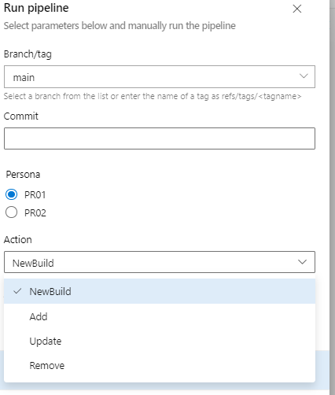
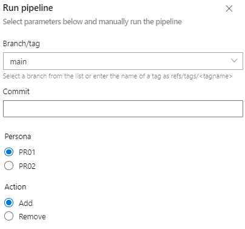

# User Guide 

## Table of Contents

* [Configration Files](#configuration-files)
* [Azure Pipelines](#azure-pipelines)

## Configuration Files

The solution relies on two(2) types of configuration files: [common variables](../config/variables/common.yml) that are shared across AVD Persona deployments and [configuration files per AVD Persona](../config/Persona). 

### Shared Infrastucture or common variables

Common variables for shared infrastructure are located in [common.yml](../config/variables/common.yml). This includes variables required for Azure Pipelines as well as the values for Key Vault, Azure Storage account used for user profiles storage and custom script execution. 

**Sample of common.yml (AVD shared infrastructure values)**
```yml
....
  VaultName: AzLabCACN-VMs-Infra
  VaultResourceGroupName: AzLabCACN-AVD-SharedInfra
  VaultSubscriptionId: 4f6c98e1-04a4-49f0-abce-6240b1726c3f
  CoreInfra-resourceGroupName: AzLabCACN-AVD-SharedInfra  # Resource Group to deploy AVD core infra (if needed): VNET, LGA and Key Vault
  storageaccountForScripts: azlabcacndevops   # storage account for customization script. Assuming in the same subscription as AIB deployment
  storageaccountRG: AzLabCACN-AVD-SharedInfra  # storage account resource group for customizations. Assuming in the same subscription as AIB deployment
  container: avd    # container where the customization scripts would reside 
```
### Persona configration file(s)

AVD Persona configuration is stored the corresponding YAML file in [./config/Persona](../config/Persona). The objective of the Persona configuration files is to capture the configration parameters such as number of the session hosts per Pod, custom or marketplace image to be used, VNET for deployment, Active Directory domain and OU, Azure Storage account for user profiles. 

To customize (if required) the individual parameters for any Pod with in Persona - the value(s) should be provided in the **variablesOverrides**. For example, for Pod01 in Persona01 the session hosts are to be deployed with marketplace image of Windows10 with Office 365 and the user group 'AVD-TestUsers' should be assigned. 

```yml
######################## Pod(s) Configuration #############################################
  - name: pods
    type: object
    default:
      - podId: POD01
        numberOfVMs: 2  # number of VMs to add to the pool 
        variableOverrides: 
          image: Windows10withO365
          userGroupName: AVD-TestUsers
      - podId: POD02
        numberOfVMs: 1  # number of VMs to add to the pool 

```
Otherwise the Pods would be configured with parameters specified in the configuration file. 

The Persona configuration file can be modified post initial deployment for the tasks such as: 
 - Increasing number of VMs in the Pod(s) Host Pool(s).
 - Updating the VMs with new version of the image. It could be either marketplace or custom image. 
 - Complete cleanup of the virtual machines.
 - User assignment 

To add new Persona - create Persona##.yml under [./config/Persona](../config/Persona) following the structure provided in the [PR01.yml](../config/Persona/PR01.yml). Update [./.pipeline/main-avd-pipeline.yml](../.pipeline/main-avd-pipeline.yml) to add new Persona ID under values for parameter 'persona'

```yml
######################## Pod(s) Configuration #############################################
parameters:
  - name: persona
    displayName: Persona
    type: string
    values:
      - PR01
      - PR##

```

## Azure Pipelines

The following pipelines are created and used: 


All pipelines are in **.pipelines/** folder.

Pipelines are stored as YAML definitions in Git and imported into Azure DevOps Pipelines.  This approach allows for portability and change tracking.  To import a pipeline:

1.  Go to Pipelines
2.  New Pipeline
3.  Choose Azure Repos Git
4.  Select Repository
5.  Select Existing Azure Pipeline YAML file
6.  Identify the pipeline using the table below and add.

Use the [Deployment Guide](DeploymentGuide.md) for initial deployment and configuration of Azure Pipelines. 

| Pipeline | YAML Definition | Pipeline Name | Purpose | Service Principal Account | Variables |
| --- | --- | --- | --- | --- | --- |
| Deploy and Manage AVD Session Hosts VMs | main-avd-vm-management.yml | AVD-SessionHost-Management | Pipeline used for:  new deployment of the VMs. Increasing host pool by adding VMs to existing AVD Host Pool. Replacing session hosts in the AVD Host Pool with updated image. Unregistering from AVD Host Pool and removal of the VMs (complete cleanup)  | spn-ado-azure-avd | Relies on Persona##.yml in [/config/Persona](../config/Persona) |
| Deploy AVD resources for Persona and its PODs| main-avd-pipeline.yml | Main-AVD-Build | Deploys AVD Workspace for Persona, Pod Application Groups/HostPools and Azure File shares   |  spn-ado-azure-avd | Relies on Persona##.yml in  [/config/Persona](../config/Persona) |
| AVD User Management | main-avd-user-management.yml | AVD-User-Management | Assignes/Removes Azure AD groups to Application Group.  | spn-ado-azure-avd | Relies on Persona##.yml in  [/config/Persona](../config/Persona) |
